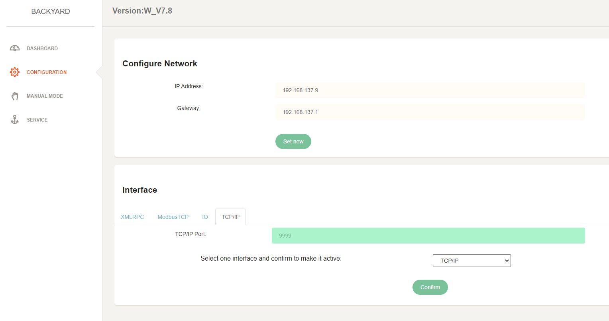
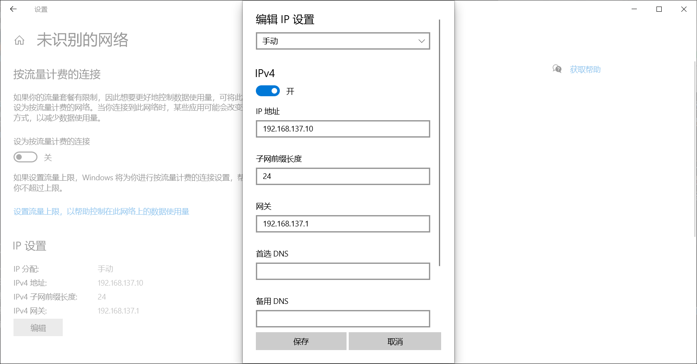

# BY-E140 Java通信调试记录
## IP配置
WiFi模式是容易连接的，这个夹爪的WiFi名是Backyard2021E140F1022，连接之后可以进入192.168.137.9进行快速配置

这个页面可以配置夹爪的IP，IP网关（里面应该存在一个路由器），TCP交互端口。这里我们使用代码连接时即通过夹爪的IP和端口。

确定了夹爪IP之后，进行有线连接的配置，通过网线连接上控制盒后，在电脑上的以太网适配器下会出现一个网络，这个网络自动获取的IP往往是不符合无线网下设置的IP前缀192.168.137.*的，需要进行修改。

子网前缀长度=子网掩码&IP地址，24就对应着255.255.255.0的子网掩码，符合文档的要求，IP只要子网前缀部分相同，非前缀部分与夹爪不同即可。比较特殊的是网关，也需要设置，否则可能无法保存IP设置。

配置好了以后，就可以在代码中连接夹爪了。
## 代码部分
### 标定
GetCalibrated()

在使用移动指令前需要进行标定，否则moveTo函数会返回字符串`"False\n"`，且不移动。读取位置时也会显示全0。

标定过程基本上就是夹爪移动到闭合状态，再移动到最大张开状态，以此测量自己的可移动范围。
### 检测标定
CalibrateGripper()

未标定时返回字符串`"0\n"`

已标定时会返回字符串`"1\n"`
### 获取状态
GetStatus()

数据示例：
`"[33, 0, 158.52045523977029, 0.0, 0.0, 12.0, 41, 1, 158.5922287540639]\n"`

1. 第一个数(33)代表通信状态，33为正常，255为异常。
2. 第二个数(0)代表电机状态，0为正常，非0为异常。
3. 第三个数(158.52)代表夹爪之间宽(mm)。
4. 第四个数(0.0)代表夹爪速度(mm/s)。
5. 第五个数(0.0)代表当前力，以百分比表示（可能是存在一个最大力，实际力可以用最大力*当前力百分比得到，但文档里没有找到最大力）。
6. 第六个数(12.0)代表当前工作电压，单位伏特。
7. 第七个数(41)代表当前电机温度。
8. 第八个数(1)代表当前是否标定
9. 第九个数(158.59)代表本次标定之下，夹爪宽度的游程范围（指令的最大值），一般都在150~160之间。

### 移动到某点
moveTo()

`moveTo(double position,double speed,double acceleration,double torque,double tolerance,boolean waitFlag)`

需要输入的参数：
1. 位置，对应夹爪宽度
2. 速度，对应夹爪运动速度
3. 加速度，对应运动加速度
4. 力矩，输入值在0~1之间，代表目标夹持力，1代表使用最大夹持力
5. 容忍范围，表示最终稳定夹持位置和期望位置间的容忍程度，如果夹持了之后与期望位置的距离大与容忍度，则会认为夹取失败，返回`"-1\n"`。
6. 是否阻塞，True表示阻塞式，False表示非阻塞式。

最后两个参数是可以不输入到指令里的，有默认值90和True。

返回值：

`"0\n"`表示运行成功，非阻塞式会提前返回运行结果。

`"-1\n"`表示运行失败，可能是bug，也可能是容忍范围未达到。

`“-2\n”`表示输入参数的类型不对，如true的位置给出了数字1

`“-3\n”`表示输入参数的数量过少。

-4和-10的情形暂未遇到，分别代表指令不支持和非法字符串。

### 重启
RestartGripper()

正常重启返回字符串`"0\n"`
### 关机
ShutdownGripper()

正常关机返回字符串`"0\n"`
## 连续发布（流式粘连测试）
在传输速度比较高时，可能存在流式读取的粘连问题（缓冲区内一次读取读到两个分开send的包，读取时就会混合） ，如果存在可以尝试使用每次返回的换行符这个特征，将其分解。但是在对夹爪测试时，2秒时间请求了5000次，暂未见到流式返回读取粘连的情况。

## 部署到机械臂控制柜
将夹爪的IP修改到了机械臂的网段下(173.31.1.*)，使两者处于同一个网段符合夹爪调用要求。

夹爪网关的设置，理论上应该与路由器网关相同，但是因为不知道路由网关所以貌似这个随便设置也可以。 

可以比较容易地兼容到其他控制中，替换力传感器部分即可。